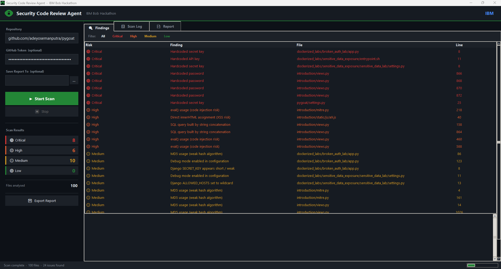
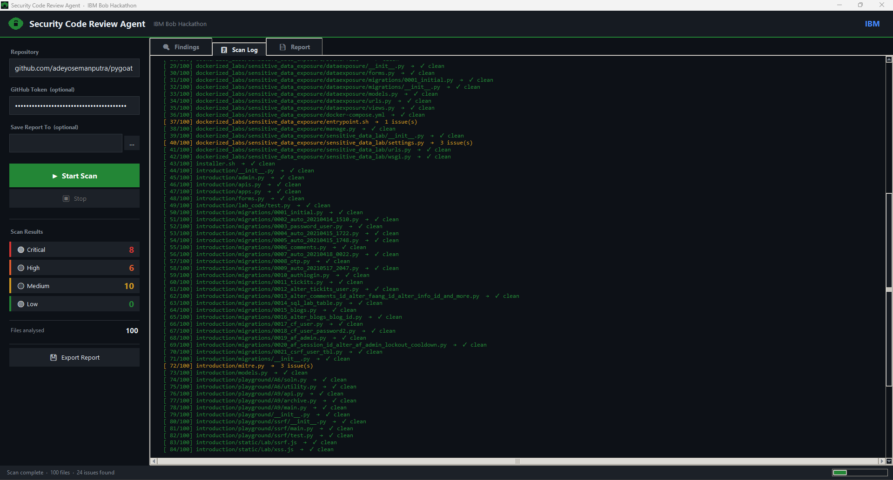
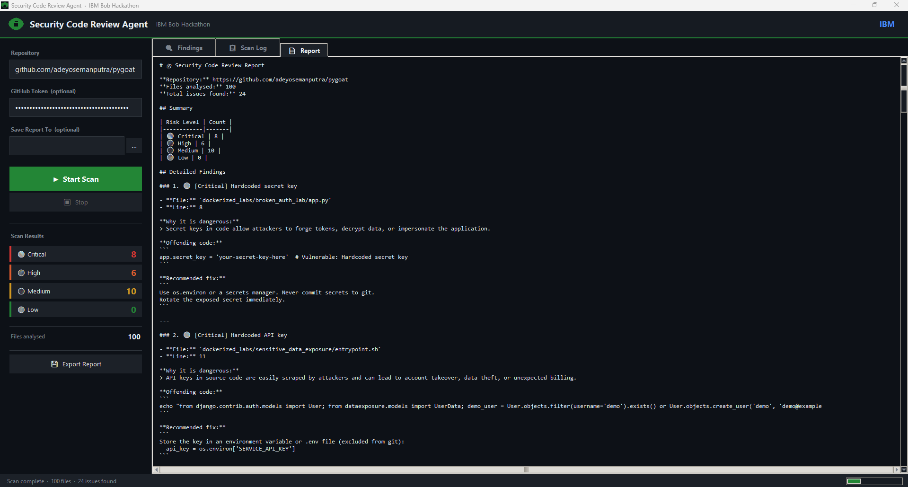

# 🔒 Security Code Review Agent
### IBM Bob 2.0 Hackathon Submission

> **Turn hours of manual security review into seconds.**  
> Paste a GitHub URL — get a full vulnerability report instantly.

---

## 👥 Team

| Name | Role |
|---|---|
| **Abdullah Zubair** | Developer |
| **Saleha Imtiaz** | Developer |

*IBM Bob 2.0 Hackathon — September 2026*

---

## 🎯 Problem

Security code reviews are:
- ⏱️ Time-consuming — hours of manual reading
- 🧠 Expertise-dependent — requires deep security knowledge  
- ❌ Often skipped — especially under deadline pressure

**Result: vulnerabilities ship to production.**

---

## ✅ Solution

A desktop application powered by **IBM Bob IDE** that:

1. Takes any GitHub repository URL as input
2. Automatically fetches all code files via GitHub API
3. Scans every file for security vulnerabilities using AI
4. Produces a structured report with exact locations and fixes

**100 files scanned · 24 issues found · in seconds.**

---

## 🖥️ Application Screenshots

### Findings Tab — All vulnerabilities listed by severity


### Scan Log Tab — Live per-file scan progress


### Report Tab — Full exportable Markdown report


---

## 🔍 Vulnerabilities Detected

| Risk | Category | Examples |
|:---:|---|---|
| 🔴 **Critical** | Hardcoded secrets | Passwords, API keys, tokens, secret keys, private keys, AWS credentials |
| 🟠 **High** | Injection | SQL string concatenation, `eval()` / code injection, `innerHTML` XSS |
| 🟡 **Medium** | Insecure config | MD5 / SHA-1 hashing, `DEBUG = True`, wildcard `ALLOWED_HOSTS`, `verify=False` |
| 🟢 **Low** | Best-practice gaps | `ssl.CERT_NONE`, miscellaneous advisory patterns |

---

## 📊 Demo Results

Tested on [PyGoat](https://github.com/adeyosemanputra/pygoat) — an intentionally 
vulnerable Python/Django application:

| 🔴 Critical | 🟠 High | 🟡 Medium | 🟢 Low | Files Scanned |
|:---:|:---:|:---:|:---:|:---:|
| 8 | 6 | 10 | 0 | 100 |

---

## 🚀 Quick Start

### GUI (Recommended)

```bash
python app.py
```

1. Paste a GitHub repository URL
2. (Optional) Add your GitHub Token for private repos
3. Click **▶ Start Scan**
4. Browse results across **Findings**, **Scan Log**, and **Report** tabs
5. Click **Export Report** to save as Markdown

### CLI

```bash
# Basic scan
python security_agent.py --repo https://github.com/owner/repo

# Save report to file
python security_agent.py --repo https://github.com/owner/repo --output report.md

# With GitHub token
python security_agent.py --repo https://github.com/owner/repo --token YOUR_TOKEN --output report.md
```

---

## 📋 Requirements

- Python **3.10+**
- **Zero third-party dependencies** — uses only Python standard library
- GitHub token optional (recommended to avoid rate limits)

---

## 📁 Project Structure

```
security-agent/
├── app.py                  ← Desktop GUI (Tkinter)
├── security_agent.py       ← Scan engine + CLI
├── generate_icon.py        ← App icon helper
├── assets/                 ← Icons and resources
├── Screenshots/            ← UI screenshots and sample report
├── bob_sessions/           ← IBM Bob IDE task session evidence
└── README.md
```

---

## 🤖 Built With IBM Bob IDE

This project was built using **IBM Bob IDE** as the core AI component.
Bob's agent mode and task system were used to:
- Architect the full application
- Write the scan engine logic
- Build the GUI interface
- Design the vulnerability detection patterns

Bob session evidence is in the [`bob_sessions/`](bob_sessions/) folder.

---

## 🧪 Test It Yourself

```bash
# PyGoat — OWASP Python/Django vulnerable app
python security_agent.py --repo https://github.com/adeyosemanputra/pygoat --output report.md

# DVPWA — Django vulnerable web app  
python security_agent.py --repo https://github.com/anxolerd/dvpwa --output report.md
```

---

## 📄 Sample Report

A full sample report from scanning PyGoat is available at  
[`Screenshots/Scan Report.txt`](Screenshots/Scan%20Report.txt)